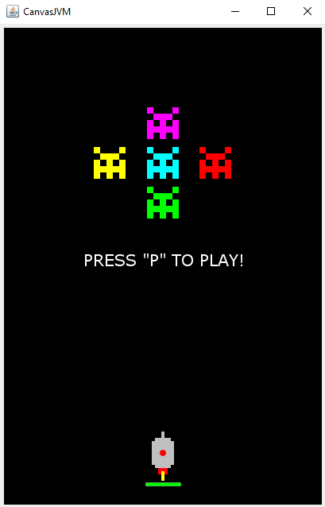

# Space_Invaders

> My version of the game Space Invaders that I'm developing.

---

### Table of Contents

- [Description](#description)
- [How To Use](#how-to-use)
- [Author Info](#author-info)

---

## Description

This is my version of the classic Space Invaders game. The player moves the ship with the mouse and shoots with the SPACE key.
You can pause / play the game with the "P" key and alternate the sound with the "S" key.

---

## How To Use
In this project I used several functions of CanvasLib, a library made by my programming teacher, so to run the code, it is necessary to download the folder "libs" and the file "build.gradle.kts".

---

## Author Info

- Twitter - [@andre_j3sus](https://twitter.com/andre_j3sus)
- Website - [André Jesus](https://sites.google.com/view/andre-jesus/p%C3%A1gina-inicial)

[Back To The Top](#space_invaders)